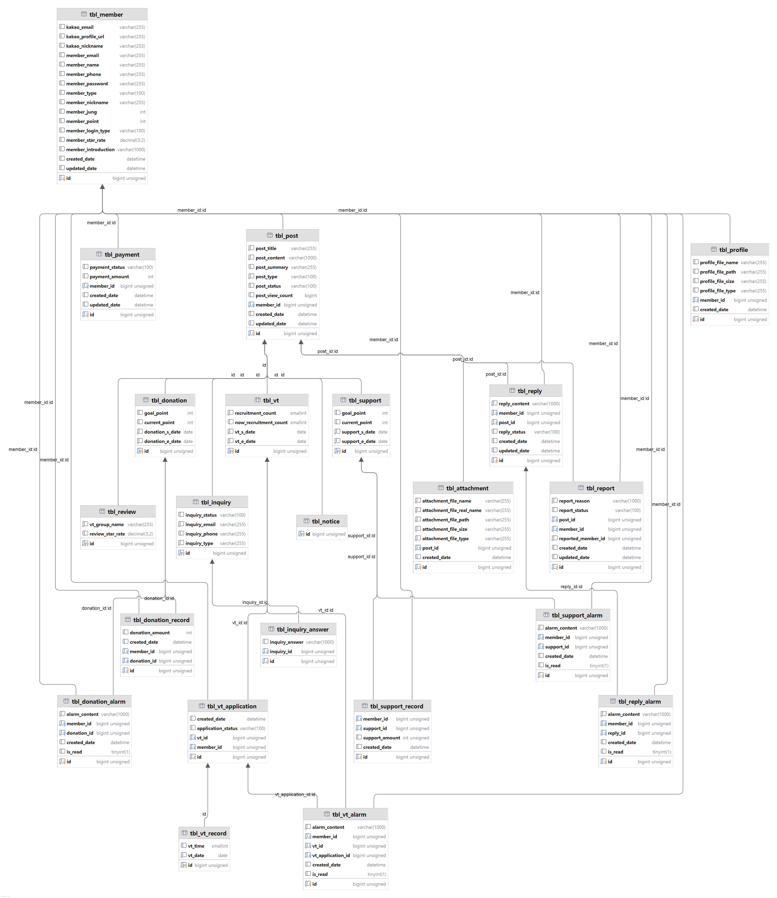
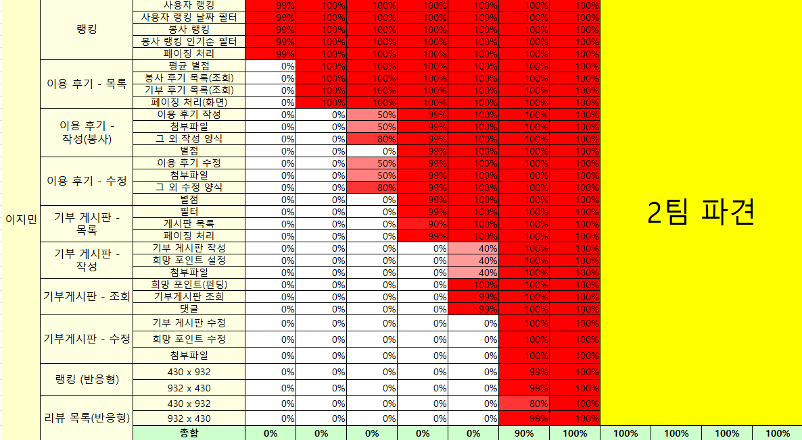
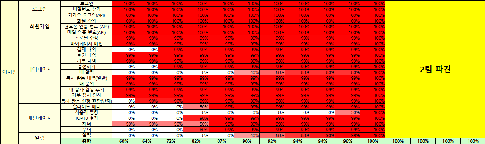
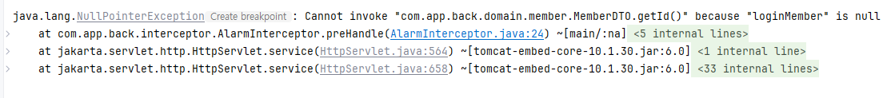
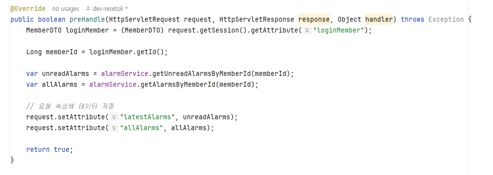
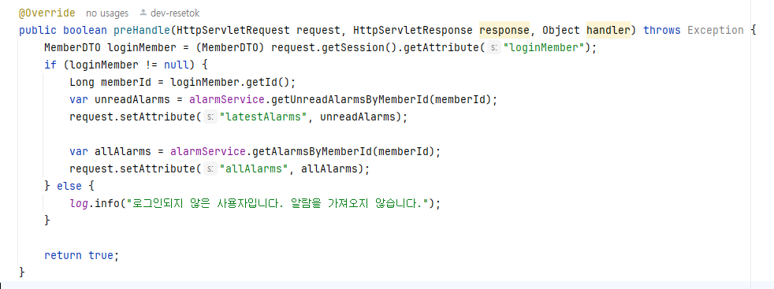

<h1>Jimin-Onjung</h1>
 
<h1>봉사와 기부를 한번에! - '온정'</h1>

<h2>1. 기획의도</h2>
<h3>1. 서비스 제작배경 및 필요성</h3>
<h4>1-1 서비스 제작 배경</h4>

최근 한국의 자원봉사 참여율이 크게 감소하고 있습니다. **2023년 기준, 전체 자원봉사 참여율은 10.6%로,2015년부터 지속적인 하락세**를 보이고 있습니다. 
특히 코로나19 이후 **자원봉사 참여 인원이 절반 이상 감소**했으며, 사회적 거리두기 완화에도 불구하고 봉사활동 참여율은 크게 회복되지 않았습니다.
 이와 같은 상황은 청소년뿐만 아니라 성인층에서도 공통적으로 나타나고 있습니다​. 
 온정은 **봉사에서 기부로 이어지는 통함 플랫폼**을 기획하여 **자원봉사의 의미와 가치를 재조명하고, 참여를 유도**하기 위해 기획되었습니다.

 <h2>2. 기대효과</h2>

 

 전반적인 자원봉사 참여율 증가와 기부 문화 확산

봉사를 통해 사회적 책임감과 공동체 의식을 강화하고, 기부에 대한 인식을 개선하며, 봉사에서 기부로 이어지는 선순환 구조를 형성하여 지속 가능한 참여를 유도하고자 합니다. 이를 통해 전반적인 자원봉사 참여율 증가와 기부 문화 확산을 기대합니다.

<h2>3. 프로젝트 사용 툴</h2>
- Java 
- Java Spring Data 
- Java Script 
- tomcat 
- MySQL 
- Spring Boot 
- Visual Studio Code 
- Sourcetree 
- git, github 
- JSON 
- JDK 
- Kakao DEVELOPER API 
- Cool SMS API 
- SMTP Gmail API 
- Slack 

<h2>4. ERD </h2>

<h2>5. 담당업무 </h2>
<h4>5-1 프론트엔드</h4>

▶랭킹
<ul>
<li>사용자 랭킹 출력</li>
<li>봉사 단체 행킹 출력</li>
</ul>

▶이용 후기
<ul>
<li>이용 후기 작성</li>
<li>이용 후기 수정</li>
<li>이용 후기 목록</li>
</ul>

▶기부 게시판
<ul>
 <li>기부 게시판 작성</li></li>
 <li>기부 게시판 수정</li>
 <li>기부 게시찬 상세</li>
 <li>기부 게시판 목록</li>
</ul>

<h4>5-2 백엔드</h4>

▶로그인
<ul>
<li>Kakao DEVELOPER API를 통한 카카오 간편 로그인 지원</li>
<li>비밀번호 재설정 시 SMTP Gmail을 사용하여 재설정 링크 발송을 통한 비밀번호 재설정</li>
</ul>
▶회원가입
<ul>
<li>회원가입 시 Cool SMS API를 사용하여 휴대폰 번호 본인인증</li>
<li>회원가입 시 SMTP Gmail을 사용하여 이메일 본인인증</li>
</ul>
▶마이페이지: 마이프로필/프로필 수정
<ul>
<li>회원의 총 봉사활동 횟수, 총 봉사활동 시간, 총 기부 포인트, 총 후원 정 수 조회(Rest)</li>
<li>프로필 수정 시 회원 닉네임과 한 줄 소개 수정 가능, 회원 프로필 사진 수정 및 업로드 가능</li>
</ul>
▶마이페이지: 결제 내역
<ul>
<li>회원의 결제 내역 조회(Rest)</li>
<li>날짜 직접 지정, 최근 1년, 1개월, 3개월, 6개월, 초기화 필터 제공</li>
</ul>
▶마이페이지: 후원 내역
<ul>
<li>회원의 최근 후원 내역 조회(Rest)</li>
<li>날짜 직접 지정, 최근 1년, 1개월, 3개월, 6개월, 초기화 필터 제공</li>
</ul>
▶마이페이지: 기부 내역
<ul>
<li>회원의 최근 기부 내역 조회(Rest)</li>
<li>날짜 직접 지정, 최근 1년, 1개월, 3개월, 6개월, 초기화 필터 제공</li>
</ul>
▶마이페이지: 봉사 활동 내역
<ul>
<li>회원의 최근 봉사 활동 내역 조회(Rest)</li>
<li>날짜 직접 지정, 최근 1년, 1개월, 3개월, 6개월, 초기화 필터 제공</li>
<li>회원의 봉사 활동에 따른 후기 작성 가능</li>
</ul>
▶마이페이지: 내 알림
<ul>
<li>회원의 최신 알림 목록 10개 조회(Rest)</li>
<li>읽지 않은 알림은 빨간색 *로 표시, 알림 읽음 처리 시 빨간색 * 사라짐</li>
<li>알림 클릭 시 각 알림이 발생한 게시글로 이동</li>
</ul>
▶마이페이지: 내 봉사 활동 후기
<ul>
<li>회원의 최근 봉사 후기 내역 조회(Rest)</li>
<li>날짜 직접 지정, 최근 1년, 1개월, 3개월, 6개월, 초기화 필터 제공</li>
<li>회원이 작성한 봉사 후기 수정 및 삭제 가능</li>
</ul>
▶마이페이지: 봉사 활동 신청 현황
<ul>
<li>단체 회원이 자신이 작성한 모집 게시글에 지원한 일반 회원 내역을 조회(Rest)</li>
<li>지원한 일반 회원의 신청 상태를 승인 및 거절로 변경 가능</li>
<li>지원한 일반 회원의 신청 상태 변경 시 일반 회원에게 알림 생성</li>
</ul>

▶메인페이지
<ul>
<li>헤더에 세션 삽입, 로그인 시 세션 유지</li>
<li>로그인 시 헤더에 알림과 프로필 사진 출력, 프로필 사진 클릭 시 마이페이지 이동 및 로그아웃 드롭다운 출력</li>
<li>헤더와 메인 페이지에 각각의 게시판 링크 연결</li>
<li>메인페이지 상단 슬라이드 배너 최신 후원 게시글 10개 출력</li>
<li>메인페이지 중단 봉사활동 시간, 기부, 후원 랭킹 월별 출력</li>
<li>메인페이지 하단 배너 최신 봉사 후기 게시글 10개 출력</li>
</ul>

▶알림
<ul>
<li>인터셉터를 통해 로그인 시 헤더에 읽지 않은 알림 출력</li>
<li>알림 클릭 시 읽음 처리 후 마이페이지의 내 알림으로 이동</li>
<li>읽지 않은 알림이 있을 시, 헤더에서 종 아이콘 옆 빨간색 *로 표시</li>
</ul>

<h2>6. 느낀점</h2>
<h3>6-1 어려웠던 부분</h3>
<h4>📌 프로필 이미지 업로드 및 썸네일 생성</h4>
<h3>6-2 문제를 해결했던 부분</h3>
<h4>📌 알람 인터셉터 구현 과정에서의 안정성 문제 해결</h4>

❗문제 상황❗ 
알람 기능을 구현하기 위해 인터셉터를 활용해 로그인한 사용자의 알람 데이터를 뷰에 전달하려 했으나 전달되지 않음

 
 
🚨문제 원인🚨 

 
 
🚀해결 방법🚀 

로그인되지 않은 사용자 처리 로직 추가로 NullPointerException 문제 해결!
  
<h4>📌 타임리프 문법으로 해결한 헤더 프로필</h4>
❗문제 상황❗ 
프로필 사진을 수정했을 때 헤더에 바로 반영되지 않고 재로그인 시에 프로필 사진이 출력됨 
 
🚨문제 원인🚨 
타임리프 템플릿 로직 부족 
 
🚀해결 방법🚀 
타임리프 템플릿에서 동적으로 URL을 반영하도록 설정
  
<h3>6-3 총평</h3>
